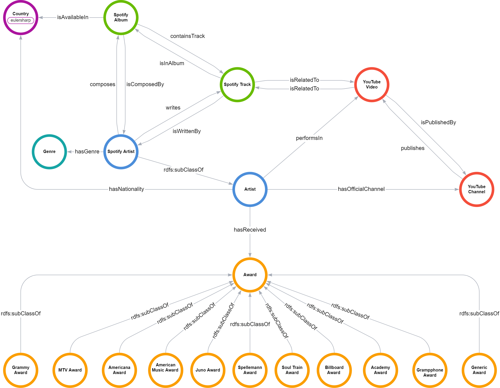

# graphdb-spotify-yt 
### SoundGraph group - University of Padova - A.A. 2023-2024
---
### Project Overview
This repository showcases our group project for the Database 2 (Graph Databases) course, where we focus on handling data related to artists, their music tracks, and videos. The project encompasses the following key stages:
- Select an open dataset.
- Create the ontology with [Protégé](https://protege.stanford.edu/).
- Ingest and clean the data.
- Serialize data with [RDFLib](https://rdflib.readthedocs.io/en/stable/).
- Store the data in [GraphDB](https://www.ontotext.com/products/graphdb/).
- Extract meaningful insights from the data.

### Domain Overview

The primary aim of our database system is to manage information in the following domains:
-   Artists/Bands.
-   Spotify data about tracks and albums.
-   YouTube videos and channels.
-   Awards received.


### Group members
| Name     | Surname | ID      |  
|----------|---------|---------|  
| Saverio  | Fincato | 2087926 |  
| Gianluca | Rossi   | 2089727 |  
| Andrea   | Segala  | 2082154 |  

### Repository structure
```  
│   graph_ontology.png  
│   LICENSE  
│   queries.md  
│   README.md  
│   requirements.txt  
├───data  
├───notebooks  
└───rdf  
```  


### Data

The project utilizes an open dataset accessible [here](https://www.kaggle.com/datasets/salvatorerastelli/spotify-and-youtube) on the Kaggle website.
Additional data files are sourced from [Wikidata](notebooks/wikidata_api.ipynb), [Spotify](notebooks/spotify_api.ipynb), and [YouTube](notebooks/youtube_api_channels.ipynb) endpoints, obtained using the corresponding APIs.

For more info: [Spotify Web API](https://developer.spotify.com/documentation/web-api), [Youtube Data API](https://developers.google.com/youtube/v3?hl=it)

### Ontology 


### Run the project
In order to run the graph database, the following steps are necessary:

1. gather all the keys useful to access the APIs mentioned above.
2. run the command ```pip -r requirements.txt``` in order to install all the necessary dependencies
3. run the notebooks [wikidata_api.ipynb](notebooks/wikidata_api.ipynb), [youtube_api_channels.ipynb](notebooks/youtube_api_channels.ipynb), [spotify_api.ipynb](notebooks/spotify_api.ipynb) to extract the data from the APIs.
4. proceed by running the [award_processing.ipynb](notebooks/award_processing.ipynb).
5. run [soundgraph_rdflib.ipynb](notebooks/soundgraph_rdflib.ipynb).
6. import the ```ttl``` and ```rdf``` files into a  ```graphdb repository```.
7. copy a specific query from the file [queries.md](queries.md) and paste it into the query section of graphdb.

**NOTE**: the notebooks must be run in the order specified above.

### Queries
The queries are present in the md file [queries.md](queries.md). Each query is composed of a description, stating what the query is doing and the code of the query itself.
