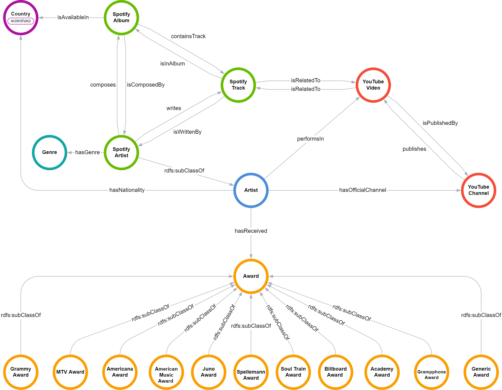

# graphdb-spotify-yt
Repository for the project of the Database 2 (Graph Databases) course, SoundGraph group.

### Group members
| Name     | Surname | ID      |
|----------|---------|---------|
| Saverio  | Fincato | 2087926 |
| Gianluca | Rossi   | 2089727 |
| Andrea   | Segala  | 2082154 |

### Repository structure
```
│   graph_ontology.png
│   LICENSE
│   queries.md
│   README.md
│   requirements.txt
├───data
├───notebooks
└───rdf
```


### Data
The dataset used for the project is available [here](https://www.kaggle.com/datasets/salvatorerastelli/spotify-and-youtube) at the Kaggle website.

The other data files are extracted from the Wikidata, Spotify and Youtube endpoints, respectively using [Wikidata](notebooks/wikidata_api.ipynb),
[Spotify](notebooks/spotify_api.ipynb) and [YouTube](notebooks/youtube_api_channels.ipynb).

For more info: [Spotify Web API](https://developer.spotify.com/documentation/web-api), [Youtube Data API](https://developers.google.com/youtube/v3?hl=it)

### Ontology 


### Run the project
In order to run the graph database, the following steps are necessary:

1. run the notebooks [wikidata_api.ipynb](notebooks/wikidata_api.ipynb), [youtube_api_channels.ipynb](notebooks/youtube_api_channels.ipynb), [spotify_api.ipynb](notebooks/spotify_api.ipynb) to extract the data from the APIs.
2. proceed by running the [award_processing.ipynb](notebooks/award_processing.ipynb).
3. run [soundgraph_rdflib.ipynb](notebooks/soundgraph_rdflib.ipynb).
4. import the ```ttl``` and ```rdf``` files into a  ```graphdb repository```.
5. copy a specific query from the file [queries.md](queries.md) and paste it into the query section of graphdb.

**NOTE**: the notebooks must be run in the order specified above.

### Queries
The queries are present in the md file [queries.md](queries.md). Each query is composed of a description, stating what the query is doing and the code of the query itself.
